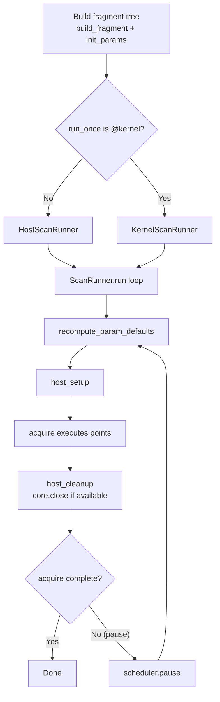
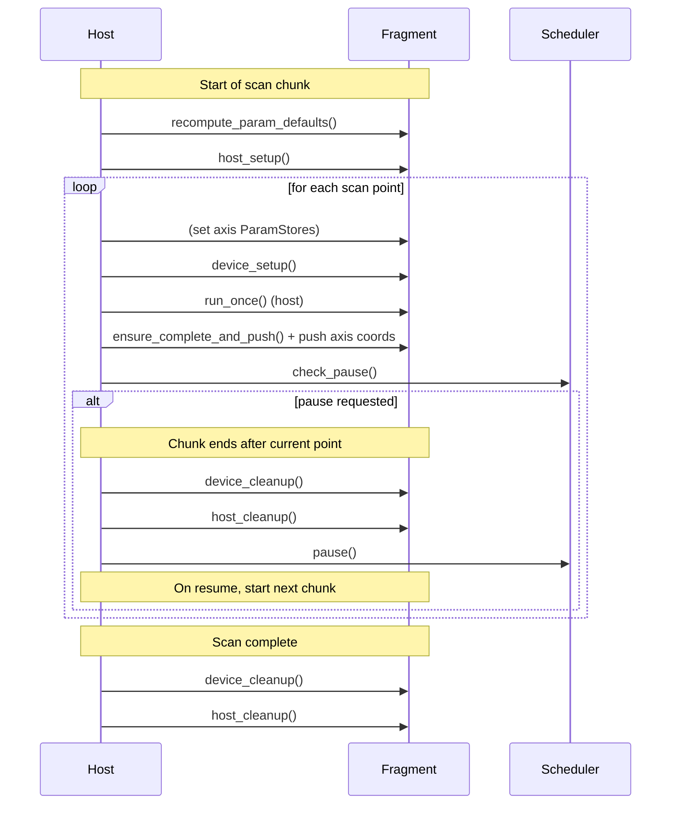
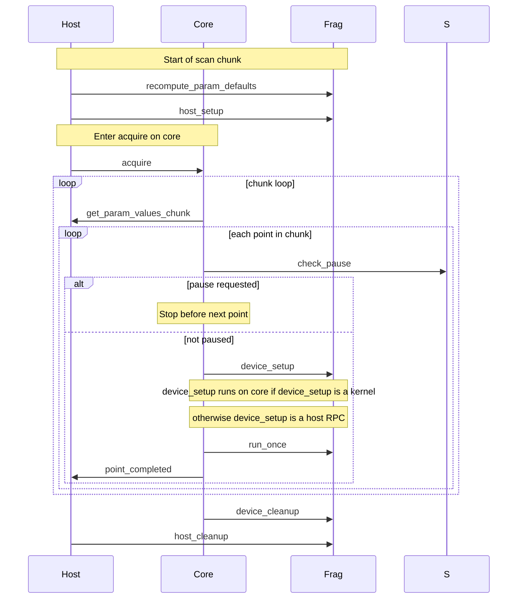
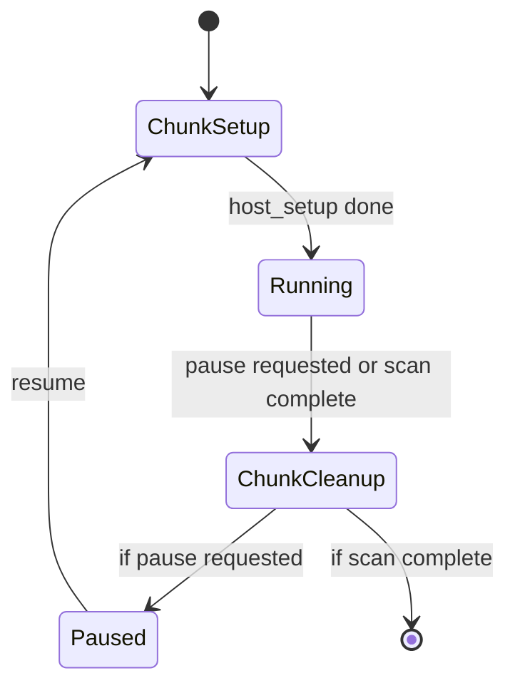

# NDScan flow

This file elucidates various flows of data within the ndscan framework.

A generic Artiq experiment looks like:
```python
from artiq.experiment import *     

class SetLED(EnvExperiment):

    def prepare(self):
        # Precompute something 'intensive' on the timescale of exp
        pass
    
    def build(self):
        self.setattr_device("core")
        self.setattr_device("led1")
        self.setattr_argument("state", BooleanValue(True))

    @kernel
    def run(self):  
        self.core.reset()
        self.led1.set_o(self.state) # Connected to L1 on front panel of Kasli SOC
```
An `EnvExperiment` is one which is both an `Experiment`, and `HasEnvironment`.
An `Experiment` says you must create `prepare()`, `run()`, `analyse()` methods.
`HasEnvironment` says you are in an Artiq context, and therefore have access to
various concepts, e.g. (arguments, devices, datasets). One of the functions you
must then implement is `build()`, which typically sets device driver handles as kernel
invariants, and requests arguments.

There are some problems with this regarding composability. It encourages a big god object sat inside run, and is hard to compose and maintain sequences.
The `ndscan` library aims to solve this.

## Runner selection + high-level scan-chunk loop (flowchart)


## HostScanRunner: per-point order + pause boundary (sequence)


## KernelScanRunner: chunking + pause polling (sequence)



## A tiny state diagram for “why did setup run again?”


