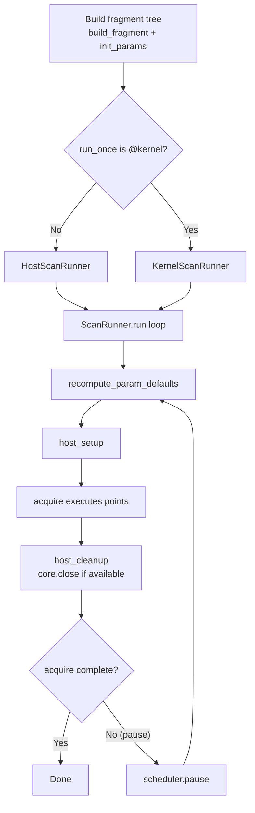

# NDScan flow

```mermaid
flowchart TD
  A[Build fragment tree<br/>build_fragment + init_params] --> B{run_once is @kernel?}
  B -- No --> H[HostScanRunner]
  B -- Yes --> K[KernelScanRunner]

  H --> L[ScanRunner.run loop]
  K --> L

  L --> C[recompute_param_defaults]
  C --> D[host_setup]
  D --> E[acquire executes points]
  E --> F[host_cleanup<br/>core.close if available]
  F --> G{acquire complete?}
  G -- Yes --> Z[Done]
  G -- No (pause) --> P[scheduler.pause]
  P --> C
```
