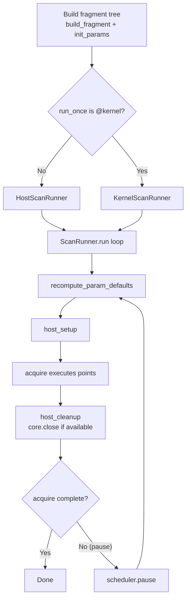
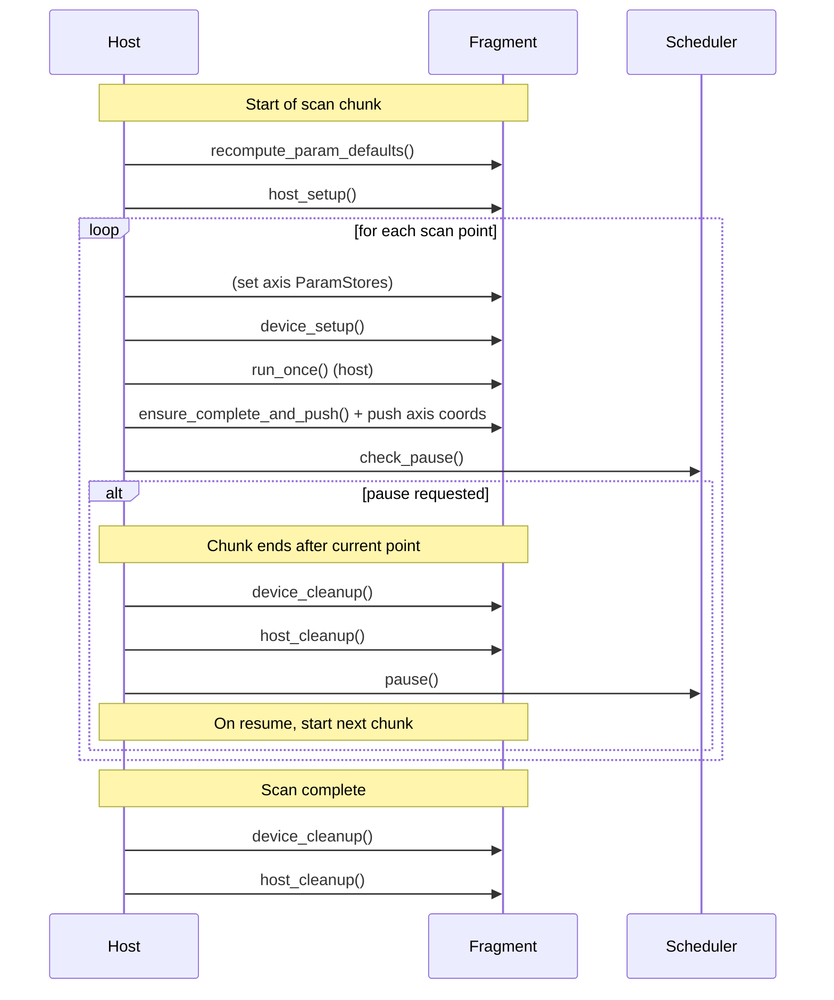
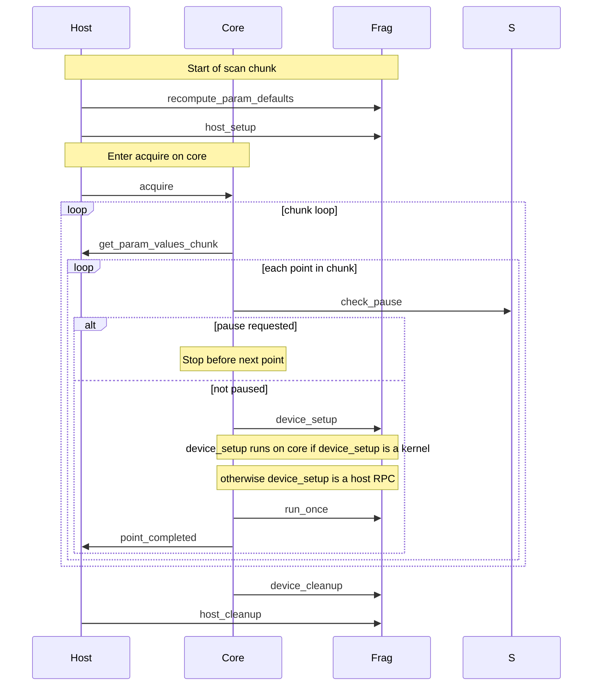
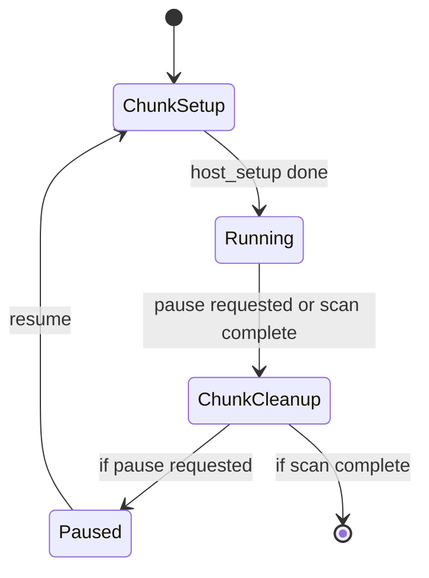

# NDScan flow (Current state)

This file elucidates various flows of data within the ndscan framework.

A generic Artiq experiment looks like:
```python
from artiq.experiment import *     

class SetLED(EnvExperiment):

    def prepare(self):
        # Precompute something 'intensive' on the timescale of exp
        pass
    
    def build(self):
        self.setattr_device("core")
        self.setattr_device("led1")
        self.setattr_argument("state", BooleanValue(True))

    @kernel
    def run(self):  
        self.core.reset()
        self.led1.set_o(self.state) # Connected to L1 on front panel of Kasli SOC
```
An `EnvExperiment` is one which is both an `Experiment`, and `HasEnvironment`.
An `Experiment` says you must create `prepare()`, `run()`, `analyse()` methods.
`HasEnvironment` says you are in an Artiq context, and therefore have access to
various concepts, e.g. (arguments, devices, datasets). One of the functions you
must then implement is `build()`, which typically sets device driver handles as kernel
invariants, and requests arguments.

There are some problems with this regarding composability. It encourages a big god object sat inside run, and is hard to compose and maintain sequences.
The `ndscan` library aims to solve this.

To convert from a default artiq `EnvExperiment` to an ndscan `Fragment` (or `ExpFragment` if it makes sense to run in isolation). You want to: turn `build` into a `build_fragment`; consider adding `host_setup`, `device_setup` and their equivelent teardown methods; and turn `run` -> `run_once` if you want it to be an `ExpFragment`. Ideally fold the contents of `prepare` into `host_setup` unless there's good performance reasons not to.

## File split 

**Define a Fragment (authoring API)**
- [fragment.py](/home/lab/artiq-files/install/ndscan/ndscan/experiment/fragment.py)
- [parameters.py](/home/lab/artiq-files/install/ndscan/ndscan/experiment/parameters.py)
- [result_channels.py](/home/lab/artiq-files/install/ndscan/ndscan/experiment/result_channels.py)
- [default_analysis.py](/home/lab/artiq-files/install/ndscan/ndscan/experiment/default_analysis.py)
- [annotations.py](/home/lab/artiq-files/install/ndscan/ndscan/experiment/annotations.py)
- [subscan.py](/home/lab/artiq-files/install/ndscan/ndscan/experiment/subscan.py) (API side: `setattr_subscan`, `SubscanExpFragment`)

**Run a Fragment (execution/orchestration)**
- [entry_point.py](/home/lab/artiq-files/install/ndscan/ndscan/experiment/entry_point.py) (top-level run/analyze/applet launch)
- [scan_runner.py](/home/lab/artiq-files/install/ndscan/ndscan/experiment/scan_runner.py) (host/kernel point loop)
- [scan_generator.py](/home/lab/artiq-files/install/ndscan/ndscan/experiment/scan_generator.py) (point generation)
- [subscan.py](/home/lab/artiq-files/install/ndscan/ndscan/experiment/subscan.py) (runtime subscan orchestration + dataset writes)
- [result_channels.py](/home/lab/artiq-files/install/ndscan/ndscan/experiment/result_channels.py) (sinks used at runtime)

**Plot Results (live/offline consumers)**
- [applet.py](/home/lab/artiq-files/install/ndscan/ndscan/applet.py) (live ARTIQ applet)
- [plots/model/subscriber.py](/home/lab/artiq-files/install/ndscan/ndscan/plots/model/subscriber.py) (live dataset -> model)
- [plots/model/subscan.py](/home/lab/artiq-files/install/ndscan/ndscan/plots/model/subscan.py) (subscan model resolution)
- [plots/xy_1d.py](/home/lab/artiq-files/install/ndscan/ndscan/plots/xy_1d.py), [plots/rolling_1d.py](/home/lab/artiq-files/install/ndscan/ndscan/plots/rolling_1d.py), [plots/image_2d.py](/home/lab/artiq-files/install/ndscan/ndscan/plots/image_2d.py)
- [plots/container_widgets.py](/home/lab/artiq-files/install/ndscan/ndscan/plots/container_widgets.py), [plots/plot_widgets.py](/home/lab/artiq-files/install/ndscan/ndscan/plots/plot_widgets.py)
- [show.py](/home/lab/artiq-files/install/ndscan/ndscan/show.py) + [results/tools.py](/home/lab/artiq-files/install/ndscan/ndscan/results/tools.py) (offline parsing/inspection)

**Where concepts are intertwined**
- `subscan.py` is the biggest mixed module (definition API + execution + dataset layout).
- `result_channels.py` mixes type definitions and runtime sink behavior.
- `default_analysis/annotations` are defined experiment-side but consumed by plot-side.
- The coupling is mostly via dataset schema keys (`axes`, `channels`, `points.*`, `completed`, etc.), not direct imports.


> [!WARNING]  
> The below mermaid diagrams were generated with generative AI, they may be incorrect.

## Runner selection + high-level scan-chunk loop (flowchart)

```mermaid
flowchart TD
  A[Build fragment tree<br/>build_fragment + init_params] --> B{run_once is @kernel?}
  B -- No --> H[HostScanRunner]
  B -- Yes --> K[KernelScanRunner]

  H --> L[ScanRunner.run loop]
  K --> L

  L --> C[recompute_param_defaults]
  C --> D[host_setup]
  D --> E[acquire executes points]
  E --> F[host_cleanup<br/>core.close if available]
  F --> G{acquire complete?}
  G -- Yes --> Z[Done]
  G -- No (pause) --> P[scheduler.pause]
  P --> C
```

## HostScanRunner: per-point order + pause boundary (sequence)

```mermaid
sequenceDiagram
  participant Host
  participant Frag as Fragment
  participant S as Scheduler

  Note over Host,Frag: Start of scan chunk
  Host->>Frag: recompute_param_defaults()
  Host->>Frag: host_setup()

  loop for each scan point
    Host->>Frag: (set axis ParamStores)
    Host->>Frag: device_setup()
    Host->>Frag: run_once()  (host)
    Host->>Frag: ensure_complete_and_push() + push axis coords
    Host->>S: check_pause()
    alt pause requested
      Note over Host,Frag: Chunk ends after current point
      Host->>Frag: device_cleanup()
      Host->>Frag: host_cleanup()
      Host->>S: pause()
      Note over Host,Frag: On resume, start next chunk
    end
  end

  Note over Host,Frag: Scan complete
  Host->>Frag: device_cleanup()
  Host->>Frag: host_cleanup()
```

## KernelScanRunner: chunking + pause polling (sequence)


```mermaid
sequenceDiagram
  participant Host
  participant Core
  participant Frag
  participant S

  Note over Host,Frag: Start of scan chunk
  Host->>Frag: recompute_param_defaults
  Host->>Frag: host_setup

  Note over Host,Core: Enter acquire on core
  Host->>Core: acquire

  loop chunk loop
    Core->>Host: get_param_values_chunk
    loop each point in chunk
      Core->>S: check_pause
      alt pause requested
        Note over Core: Stop before next point
      else not paused
        Core->>Frag: device_setup
        Note over Core,Frag: device_setup runs on core if device_setup is a kernel
        Note over Core,Frag: otherwise device_setup is a host RPC
        Core->>Frag: run_once
        Core->>Host: point_completed
      end
    end
  end

  Core->>Frag: device_cleanup
  Host->>Frag: host_cleanup
```

## A tiny state diagram for “why did setup run again?”


```mermaid
stateDiagram-v2
  [*] --> ChunkSetup
  ChunkSetup --> Running: host_setup done
  Running --> ChunkCleanup: pause requested or scan complete
  ChunkCleanup --> Paused: if pause requested
  ChunkCleanup --> [*]: if scan complete
  Paused --> ChunkSetup: resume
```

## Proposed Changes.

### Potential organisational improvements:

It is already fairly clean. I wouldn’t do a big re-org.

**High-Value Improvements**
1. Split subscan API from subscan runtime plumbing.  
`[subscan.py](/home/lab/artiq-files/install/ndscan/ndscan/experiment/subscan.py)` currently mixes:
- fragment-facing API (`SubscanExpFragment`, `setattr_subscan`)
- scan orchestration
- dataset layout/writes  
A small split into `subscan_api.py` + `subscan_runtime.py` (or similar) would make boundaries much clearer.

2. Move dataset schema/layout logic into one shared module.  
Right now naming/layout knowledge is spread across:
- `[subscan.py](/home/lab/artiq-files/install/ndscan/ndscan/experiment/subscan.py)`
- `[entry_point.py](/home/lab/artiq-files/install/ndscan/ndscan/experiment/entry_point.py)`
- `[plots/model/subscan.py](/home/lab/artiq-files/install/ndscan/ndscan/plots/model/subscan.py)`
- `[results/tools.py](/home/lab/artiq-files/install/ndscan/ndscan/results/tools.py)`
- `[show.py](/home/lab/artiq-files/install/ndscan/ndscan/show.py)`  
Centralizing keys/prefix rules/metadata schema would reduce drift bugs.

3. Separate channel types from sink implementations.  
`[result_channels.py](/home/lab/artiq-files/install/ndscan/ndscan/experiment/result_channels.py)` contains both “what a channel is” and “how data is written”.  
A light split (e.g. `channels.py` and `sinks.py`) improves readability and testing.

4. Introduce a strategy interface before adding adaptive scans.  
Keep `[scan_runner.py](/home/lab/artiq-files/install/ndscan/ndscan/experiment/scan_runner.py)` stable, but add a small strategy abstraction first so grid/tandem/adaptive can plug in without branching everywhere.

5. Add explicit layer tests.  
Keep existing tests, but add a few “contract tests” that assert:
- experiment writes schema correctly
- plotting can consume it
- results tools can parse it  
This protects the clean split as features grow.


So: **mostly decoupled**, but with a few central modules intentionally bridging layers.


## Plans for improvements

Great direction. I’d do this as a staged architecture change, not a single big refactor.

**1) Target Execution Model**
Use one unified “scan program” pipeline for top-level and subscan:

```python
point = strategy.next_point()                 # none/grid/zip/adaptive
resolved = relation_graph.resolve(point)      # pseudo/formula/callable derived params
apply_to_param_stores(resolved)               # actual fragment stores
run_fragment_once()
results = collect_result_channels()
strategy.observe(point, results)              # no-op for grid; ask/tell for adaptive
record_point(point, resolved, results)
```

This keeps `ExpFragment` mostly declarative and pushes orchestration into a reusable runner layer.

**2) Core New Abstractions**
I’d add these first:

```python
@dataclass
class ScanProgram:
    strategy: PointStrategy
    relations: RelationGraph
    display_axes: list[AxisRef]       # what becomes axis_0/axis_1...
    recorded_params: list[ParamRef]   # what becomes points.param_*
```

```python
class PointStrategy(Protocol):
    def describe(self) -> dict: ...
    def reset(self) -> None: ...
    def next_point(self) -> dict[ParamRef, Any] | None: ...
    def observe(self, point: dict, results: dict) -> None: ...
```

```python
class RelationGraph:
    def validate(self) -> None: ...    # cycles, missing deps, conflicts
    def resolve(self, base_point: dict[ParamRef, Any]) -> dict[ParamRef, Any]: ...
```

This gives you:
- no scan / 1D / 2D as strategies
- tandem zip as strategy
- adaptive GP/M-LOOP as strategy
- pseudo/formula propagation in `RelationGraph`, independent of strategy

**3) Fragment-Side API**
Add two explicit APIs.

Code-defined pseudo parameters:
```python
self.setattr_pseudoparam("detuning", FloatParam, "Detuning", default=0.0)
self.bind_param_relation(
    target=self.aom_freq,
    deps=[self.detuning, self.transition_freq],
    fn=lambda detuning, f0: f0 - detuning,
)
```

Perhaps we also want a similar way to just put text in like:
```python
self.setattr_pseudo_param(
    "detuning",
    FloatParam,
    "Light detuning",
    drives=[(self.aom, "rf_freq")],
    expr="f_transition - detuning"
)
```

UI-defined formulas (serialized in params):
```python
scan["relations"] = [{
  "target": "aom/rf_amp",
  "expr": "amp_from_freq(aom/rf_freq)",
  "deps": ["aom/rf_freq"],
  "enabled": True,
  "origin": "ui"
}]
```

Important rule:
- A parameter cannot be both directly scanned and relation-driven at the same time.
- Use clear conflict errors in argument editor and prepare-time validation.

**4) Strategy Set**
Implement strategies in order:

1. `FixedRepeatStrategy` (no scan).
2. `GridStrategy` (current 1D/2D/cartesian via existing generators).
3. `TandemZipStrategy` (zip groups).
4. `AdaptiveAskTellStrategy` (host-only initially; GP/M-LOOP backend).

For adaptive, define backend interface:
```python
class OptimizerBackend(Protocol):
    def ask(self) -> dict[str, float]: ...
    def tell(self, x: dict[str, float], y: float, aux: dict) -> None: ...
```

**5) Runner Changes**
Do not break current runner immediately. Add a new host runner first:

- New `ProgramScanRunner` host-only.
- Keep existing `ScanRunner` + `KernelScanRunner` unchanged for legacy grid path.
- `TopLevelRunner` and `Subscan` choose legacy or program runner by schema/mode.

Later, you can fold grid mode back onto `ProgramScanRunner` once stable.

**6) Data Layout**
Keep the site-based flat layout you liked.
Minimal additions for new modes:

- `mode`, `parameters`, `relations`, `strategy` metadata.
- `points.axis_i` for plotting contract.
- `points.param_<name>` for non-axis controls and derived physical values.
- `points.channel_<name>` for measured + bubbled analysis results.
- `starts` unchanged for segmentation.

This supports nested subscans naturally.

**7) Default Analysis Compatibility**
Current analysis matching relies on scanned stores. With relations/pseudoparams, that can break if varied stores are derived.

Plan:
- Extend matching to use `varied_stores` from resolved points, not only declared axes.
- Or register pseudo params as formal axes when selected as display/control variables.

You should implement this early to avoid confusing missing-analysis behavior.

**8) Dashboard/Argument Editor Plan**
Add one new mode at a time:

1. Add relation serialization support, no UI editor yet (manual schema for tests).
2. Add simple formula field UI for numeric params.
3. Add pseudo-param visibility and “drives” greying/locking behavior.
4. Add strategy selector (`grid`, `tandem`, `adaptive`) and backend config panel.

Use safe AST evaluation for formulas. Do not use raw `eval` for runtime relations.

**9) Kernel Story (important for Oxford groups)**
Pragmatic plan:

- Phase A: Full feature set host-only in `ProgramScanRunner`.
- Phase B: Kernel support for open-loop strategies by pre-resolving points host-side and streaming to existing `KernelScanRunner`.
- Phase C: Closed-loop adaptive kernel mode only if needed; likely one-point-at-a-time ask/tell with host RPC boundary (throughput tradeoff).

So kernel users keep existing performance path for classic scans while new features mature.

**10) Atomic Commit Sequence**
1. Add `ScanProgram`, `PointStrategy`, `RelationGraph` skeleton + tests.
2. Add `ProgramScanRunner` with `none` + legacy `grid` strategy adapter.
3. Add relation resolution (code-defined only) + validation.
4. Add data schema fields (`mode/parameters/relations/strategy`) and param recording.
5. Add tandem strategy.
6. Add UI formula relations.
7. Add adaptive strategy backend plugin API.
8. Add initial adaptive backend (mock + optional M-LOOP adapter).
9. Add kernel bridge for open-loop program strategies.

If you want, I can next draft the exact `ndscan_params["scan"]` schema vNext in JSON so you can start with parser/validation tests first.


## Proposed dataset layout:

Use one **site-based segmented flat layout** everywhere (top-level and each subscan site).  
That handles grid, relational, and adaptive scans uniformly, including nested subscans.

```text
site = ndscan.rid_<rid>.                    # top level
site = ndscan.rid_<rid>.subscan_flat.<id>.  # any subscan site
```

For every `site`:

```text
<site>ndscan_schema_revision
<site>source_id
<site>completed
<site>fragment_fqn
<site>mode                  # "none" | "grid" | "relational" | "adaptive"
<site>axes                  # JSON schema for plotted axes
<site>channels              # JSON schema for result channels
<site>parameters            # JSON schema for driven params (base + derived)
<site>relations             # JSON (formula/pseudoparam definitions)
<site>strategy              # JSON (grid/tandem/optimizer config)

<site>points.axis_0
<site>points.axis_1
...
<site>points.param_<name>      
<site>points.channel_<name>    # measured + bubbled analysis channels

<site>starts                   # segment starts, one per parent point/call
```

Key rule for nesting:
- `starts[i]` at a subscan site corresponds to **parent point index `i` at the parent site**.
- So mapping is recursive:
  - top-level point `i` -> subscan segment `i`
  - subscan point `j` -> sub-subscan segment `j`

All `points.` arrays at a site must have equal length; `starts` length equals number of parent points that launched that site; `starts` is monotonic.

---

### Example: top-level adaptive + child subscan with bubbled analysis

```text
ndscan.rid_2401.points.param_detuning            [1.2, 1.6, 1.1, 1.9]
ndscan.rid_2401.points.param_intensity           [0.4, 0.5, 0.45, 0.55]
ndscan.rid_2401.points.channel_cost              [0.23, 0.11, 0.19, 0.08]
ndscan.rid_2401.points.channel_scanx_fit_e       [1.98, 2.03, 1.95, 2.07]   # bubbled
```

Child site (run once per top-level shot):
```text
ndscan.rid_2401.subscan_flat.root_subscan_scanx__abcd1234.starts             [0, 6, 12, 18]
ndscan.rid_2401.subscan_flat.root_subscan_scanx__abcd1234.points.axis_0      [x... flattened]
ndscan.rid_2401.subscan_flat.root_subscan_scanx__abcd1234.points.channel_y   [y... flattened]
ndscan.rid_2401.subscan_flat.root_subscan_scanx__abcd1234.points.channel_m   [m... flattened]
```

Interpretation:
- top-level point `2` uses child slice `[starts[2]:starts[3]] = [12:18]`.

---

### Example: relational mode

```text
mode = "relational"
relations = {
  "derived": [
    {"target": "aom.rf_freq", "expr": "transition_freq - detuning"},
    {"target": "aom.rf_amp",  "expr": "amp_from_freq(aom.rf_freq)"}
  ]
}
```

Per shot you still store actual driven values:

```text
points.param_detuning
points.param_aom_rf_freq
points.param_aom_rf_amp
points.channel_fluorescence
```

So analysis/plotting always sees true hardware values, regardless of pseudoparam formulas.

---

### Live view stream (separate from archive)
Keep current preview stream for active segment only:

```text
ndscan.rid_<rid>.subscan_preview.<id>.points.*
ndscan.rid_<rid>.subscan_preview.<id>.completed
```

Flat stream is canonical/archiveable. Preview is for live UI.  
This split keeps ragged-safe persistence while allowing live recursive plotting.

Note: I think that there's some redundency here with say, axis_0 and param_name in this schema.


## MISC

Some copy pastes of potential other stuff that may be useful:
2. Introduce a SubscanDatasetWriter that owns preview + flat stream policy
Subscan currently mixes orchestration, sinks, metadata, and segment bookkeeping. Split write mechanics out.
```python
class SubscanDatasetWriter:
    def __init__(self, runner, site: SubscanSite):
        self._runner = runner
        self._site = site
        self._next_flat_index = 0

    def begin_subscan(self, scan_desc: dict) -> None:
        self._write_metadata("subscan_preview", scan_desc, completed=False)
        self._write_metadata("subscan_flat", self._flat_desc(scan_desc), completed=False)
        self._clear_preview_points()

    def append_preview_point(self, axis_values: dict, channel_values: dict) -> None:
        ...

    def append_flat_point(self, axis_values: dict, channel_values: dict) -> None:
        ...

    def close_subscan(self, num_points: int) -> None:
        self._append_flat_start(self._next_flat_index)
        self._next_flat_index += num_points
        self._set_completed("subscan_preview", True)
        self._set_completed("subscan_flat", True)
```
Why better:

makes sink behavior explicit
removes duplicated metadata push paths
gives one place to evolve flat schema

## Plan:

Good call. Here’s an **implementation-first roadmap** (feature -> how to check it works), not just unit-test-first.

1. **Add relation engine (code-defined only, no UI)**
- Implement: `RelationGraph` + `bind_param_relation(...)` on fragment side.
- Scope: host runner only, existing grid scans unchanged.
- Check: make a tiny experiment where `q = p**2 + 4`, scan `p=[3,6,7]`, print/use `q` in `run_once`; verify values are `[13, 40, 53]` during run and in datasets.
- Commit: `feat(experiment): add relation graph and code-defined derived params`

2. **Record applied parameter vectors in datasets**
- Implement: write `points.param_*` for non-axis params + metadata alias from `axis_i -> param`.
- Check: rerun step 1 example, inspect datasets and confirm:
  - `points.axis_0` exists for scanned axis
  - `points.param_q` exists for derived param
  - no duplicate param dataset for axis param unless explicitly enabled.
- Commit: `feat(data): record applied params per point with axis alias metadata`

3. **Add tandem/zip scan mode**
- Implement: zip-group point generation (not Cartesian) for selected axes.
- Check: scan `a=[1,2,3]`, `b=[10,20,30]` in tandem; verify pairs are `(1,10),(2,20),(3,30)` only. Also verify mismatch lengths raise clear error.
- Commit: `feat(scan): add tandem zip strategy for linked axes`

4. **Introduce `ProgramScanRunner` with grid adapter**
- Implement: new runner path using `next_point()/observe()`, with adapter that reproduces current grid behavior.
- Check: run a 1D and 2D existing experiment through both old runner and new runner, compare point coordinates and channel arrays (same values/order).
- Commit: `refactor(runner): add ProgramScanRunner with grid compatibility adapter`

5. **Add pseudo-parameter API (code-side)**
- Implement: `setattr_pseudoparam(...)` and binding to physical params through relations.
- Check: AOM-like example where user scans pseudo detuning/intensity and physical rf params are driven; verify run uses physical driven values and datasets include them.
- Commit: `feat(fragment): add pseudo-parameter API and bindings`

6. **Add UI formula relations (serialize only first)**
- Implement: dashboard fields for formulas; store into `ndscan_params["scan"]["relations"]`.
- Check: edit in GUI, save arguments, inspect serialized params payload (no runtime execution yet).
- Commit: `feat(dashboard): serialize per-parameter relation expressions`

7. **Enable runtime execution of UI formulas with safe evaluator**
- Implement: AST-based safe expression evaluator (no raw `eval`) wired into relation graph.
- Check: formula works for valid math; blocked for unsafe expressions; clear user error messages.
- Commit: `feat(execution): evaluate UI relations safely at point runtime`

8. **Add adaptive strategy interface + mock backend**
- Implement: `AdaptiveAskTellStrategy` + backend protocol.
- Check: run with deterministic mock optimizer, verify ask/tell loop and per-shot parameter updates.
- Commit: `feat(scan): add adaptive ask/tell strategy interface`

9. **Subscan integration**
- Implement: allow subscans to use same strategy/relation pipeline; keep `starts` mapping intact.
- Check: nested example (top-level + subscan) with derived params and bubbled results; verify correct segment slicing per parent index.
- Commit: `feat(subscan): support program strategies and relations in subscans`

10. **Kernel bridge (open-loop first)**
- Implement: pre-resolve open-loop points host-side and stream to existing kernel runner.
- Check: emulator kernel tests for grid+tandem+relations pass; adaptive remains host-only initially.
- Commit: `feat(kernel): bridge open-loop program points to kernel runner`

---

If you want a concrete “start now” item: do **Step 1** first. It’s small, user-visible immediately, and doesn’t force runner/UI rewrites yet.