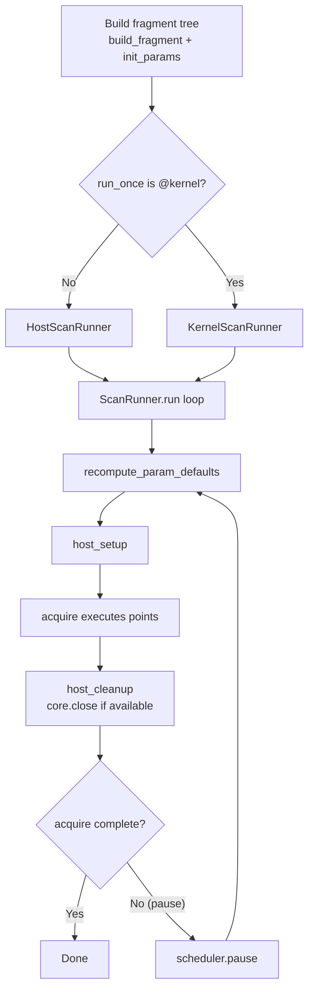
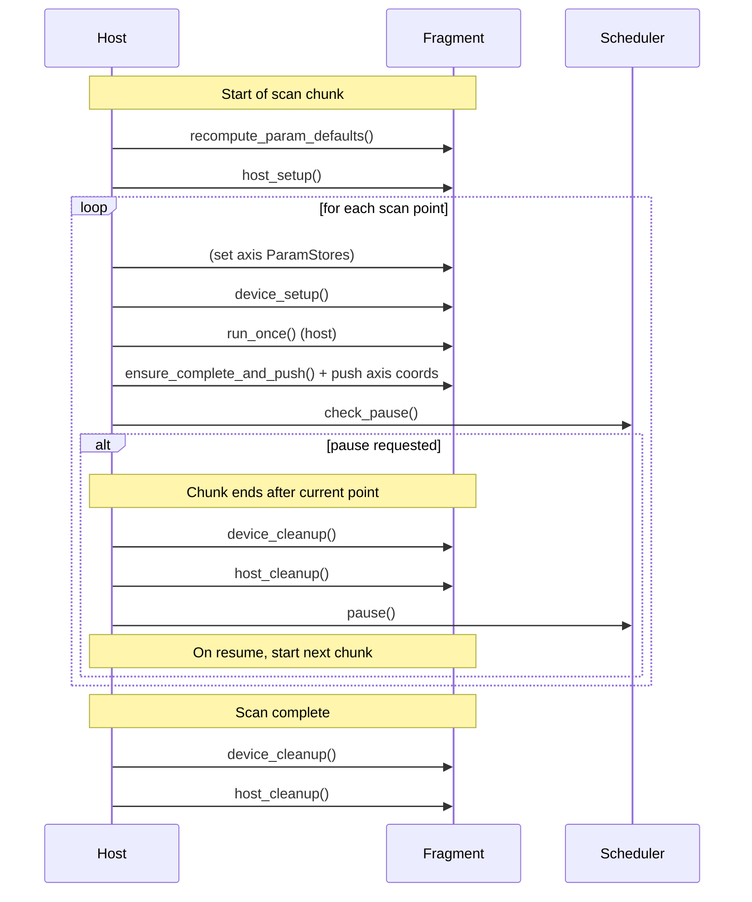
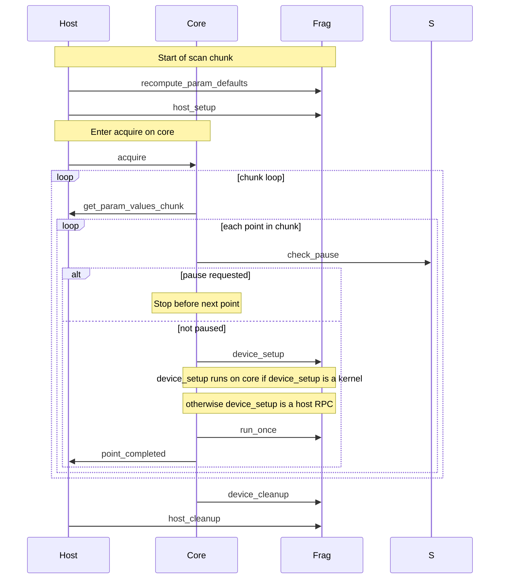
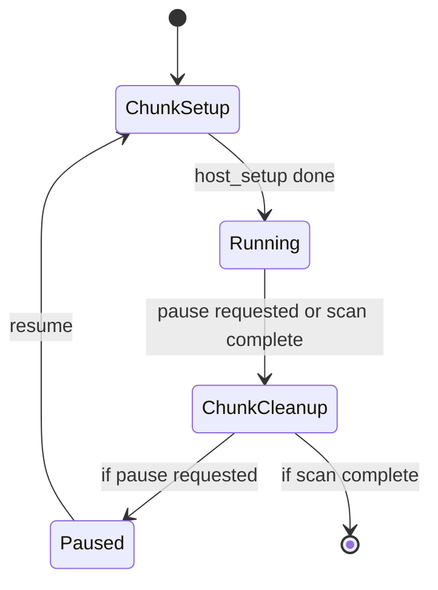

# NDScan flow (Current state)

This file elucidates various flows of data within the ndscan framework.

A generic Artiq experiment looks like:
```python
from artiq.experiment import *     

class SetLED(EnvExperiment):

    def prepare(self):
        # Precompute something 'intensive' on the timescale of exp
        pass
    
    def build(self):
        self.setattr_device("core")
        self.setattr_device("led1")
        self.setattr_argument("state", BooleanValue(True))

    @kernel
    def run(self):  
        self.core.reset()
        self.led1.set_o(self.state) # Connected to L1 on front panel of Kasli SOC
```
An `EnvExperiment` is one which is both an `Experiment`, and `HasEnvironment`.
An `Experiment` says you must create `prepare()`, `run()`, `analyse()` methods.
`HasEnvironment` says you are in an Artiq context, and therefore have access to
various concepts, e.g. (arguments, devices, datasets). One of the functions you
must then implement is `build()`, which typically sets device driver handles as kernel
invariants, and requests arguments.

There are some problems with this regarding composability. It encourages a big god object sat inside run, and is hard to compose and maintain sequences.
The `ndscan` library aims to solve this.

To convert from a default artiq `EnvExperiment` to an ndscan `Fragment` (or `ExpFragment` if it makes sense to run in isolation). You want to: turn `build` into a `build_fragment`; consider adding `host_setup`, `device_setup` and their equivelent teardown methods; and turn `run` -> `run_once` if you want it to be an `ExpFragment`. Ideally fold the contents of `prepare` into `host_setup` unless there's good performance reasons not to.

## File split 

**Define a Fragment (authoring API)**
- [fragment.py](/home/lab/artiq-files/install/ndscan/ndscan/experiment/fragment.py)
- [parameters.py](/home/lab/artiq-files/install/ndscan/ndscan/experiment/parameters.py)
- [result_channels.py](/home/lab/artiq-files/install/ndscan/ndscan/experiment/result_channels.py)
- [default_analysis.py](/home/lab/artiq-files/install/ndscan/ndscan/experiment/default_analysis.py)
- [annotations.py](/home/lab/artiq-files/install/ndscan/ndscan/experiment/annotations.py)
- [subscan.py](/home/lab/artiq-files/install/ndscan/ndscan/experiment/subscan.py) (API side: `setattr_subscan`, `SubscanExpFragment`)

**Run a Fragment (execution/orchestration)**
- [entry_point.py](/home/lab/artiq-files/install/ndscan/ndscan/experiment/entry_point.py) (top-level run/analyze/applet launch)
- [scan_runner.py](/home/lab/artiq-files/install/ndscan/ndscan/experiment/scan_runner.py) (host/kernel point loop)
- [scan_generator.py](/home/lab/artiq-files/install/ndscan/ndscan/experiment/scan_generator.py) (point generation)
- [subscan.py](/home/lab/artiq-files/install/ndscan/ndscan/experiment/subscan.py) (runtime subscan orchestration + dataset writes)
- [result_channels.py](/home/lab/artiq-files/install/ndscan/ndscan/experiment/result_channels.py) (sinks used at runtime)

**Plot Results (live/offline consumers)**
- [applet.py](/home/lab/artiq-files/install/ndscan/ndscan/applet.py) (live ARTIQ applet)
- [plots/model/subscriber.py](/home/lab/artiq-files/install/ndscan/ndscan/plots/model/subscriber.py) (live dataset -> model)
- [plots/model/subscan.py](/home/lab/artiq-files/install/ndscan/ndscan/plots/model/subscan.py) (subscan model resolution)
- [plots/xy_1d.py](/home/lab/artiq-files/install/ndscan/ndscan/plots/xy_1d.py), [plots/rolling_1d.py](/home/lab/artiq-files/install/ndscan/ndscan/plots/rolling_1d.py), [plots/image_2d.py](/home/lab/artiq-files/install/ndscan/ndscan/plots/image_2d.py)
- [plots/container_widgets.py](/home/lab/artiq-files/install/ndscan/ndscan/plots/container_widgets.py), [plots/plot_widgets.py](/home/lab/artiq-files/install/ndscan/ndscan/plots/plot_widgets.py)
- [show.py](/home/lab/artiq-files/install/ndscan/ndscan/show.py) + [results/tools.py](/home/lab/artiq-files/install/ndscan/ndscan/results/tools.py) (offline parsing/inspection)

**Where concepts are intertwined**
- `subscan.py` is the biggest mixed module (definition API + execution + dataset layout).
- `result_channels.py` mixes type definitions and runtime sink behavior.
- `default_analysis/annotations` are defined experiment-side but consumed by plot-side.
- The coupling is mostly via dataset schema keys (`axes`, `channels`, `points.*`, `completed`, etc.), not direct imports.


> [!WARNING]  
> The below mermaid diagrams were generated with generative AI, they may be incorrect.

## Runner selection + high-level scan-chunk loop (flowchart)

```mermaid
flowchart TD
  A[Build fragment tree<br/>build_fragment + init_params] --> B{run_once is @kernel?}
  B -- No --> H[HostScanRunner]
  B -- Yes --> K[KernelScanRunner]

  H --> L[ScanRunner.run loop]
  K --> L

  L --> C[recompute_param_defaults]
  C --> D[host_setup]
  D --> E[acquire executes points]
  E --> F[host_cleanup<br/>core.close if available]
  F --> G{acquire complete?}
  G -- Yes --> Z[Done]
  G -- No (pause) --> P[scheduler.pause]
  P --> C
```

## HostScanRunner: per-point order + pause boundary (sequence)

```mermaid
sequenceDiagram
  participant Host
  participant Frag as Fragment
  participant S as Scheduler

  Note over Host,Frag: Start of scan chunk
  Host->>Frag: recompute_param_defaults()
  Host->>Frag: host_setup()

  loop for each scan point
    Host->>Frag: (set axis ParamStores)
    Host->>Frag: device_setup()
    Host->>Frag: run_once()  (host)
    Host->>Frag: ensure_complete_and_push() + push axis coords
    Host->>S: check_pause()
    alt pause requested
      Note over Host,Frag: Chunk ends after current point
      Host->>Frag: device_cleanup()
      Host->>Frag: host_cleanup()
      Host->>S: pause()
      Note over Host,Frag: On resume, start next chunk
    end
  end

  Note over Host,Frag: Scan complete
  Host->>Frag: device_cleanup()
  Host->>Frag: host_cleanup()
```

## KernelScanRunner: chunking + pause polling (sequence)


```mermaid
sequenceDiagram
  participant Host
  participant Core
  participant Frag
  participant S

  Note over Host,Frag: Start of scan chunk
  Host->>Frag: recompute_param_defaults
  Host->>Frag: host_setup

  Note over Host,Core: Enter acquire on core
  Host->>Core: acquire

  loop chunk loop
    Core->>Host: get_param_values_chunk
    loop each point in chunk
      Core->>S: check_pause
      alt pause requested
        Note over Core: Stop before next point
      else not paused
        Core->>Frag: device_setup
        Note over Core,Frag: device_setup runs on core if device_setup is a kernel
        Note over Core,Frag: otherwise device_setup is a host RPC
        Core->>Frag: run_once
        Core->>Host: point_completed
      end
    end
  end

  Core->>Frag: device_cleanup
  Host->>Frag: host_cleanup
```

## A tiny state diagram for “why did setup run again?”


```mermaid
stateDiagram-v2
  [*] --> ChunkSetup
  ChunkSetup --> Running: host_setup done
  Running --> ChunkCleanup: pause requested or scan complete
  ChunkCleanup --> Paused: if pause requested
  ChunkCleanup --> [*]: if scan complete
  Paused --> ChunkSetup: resume
```

## Proposed Changes.

### Potential organisational improvements:

It is already fairly clean. I wouldn’t do a big re-org.

**High-Value Improvements**
1. Split subscan API from subscan runtime plumbing.  
`[subscan.py](/home/lab/artiq-files/install/ndscan/ndscan/experiment/subscan.py)` currently mixes:
- fragment-facing API (`SubscanExpFragment`, `setattr_subscan`)
- scan orchestration
- dataset layout/writes  
A small split into `subscan_api.py` + `subscan_runtime.py` (or similar) would make boundaries much clearer.

2. Move dataset schema/layout logic into one shared module.  
Right now naming/layout knowledge is spread across:
- `[subscan.py](/home/lab/artiq-files/install/ndscan/ndscan/experiment/subscan.py)`
- `[entry_point.py](/home/lab/artiq-files/install/ndscan/ndscan/experiment/entry_point.py)`
- `[plots/model/subscan.py](/home/lab/artiq-files/install/ndscan/ndscan/plots/model/subscan.py)`
- `[results/tools.py](/home/lab/artiq-files/install/ndscan/ndscan/results/tools.py)`
- `[show.py](/home/lab/artiq-files/install/ndscan/ndscan/show.py)`  
Centralizing keys/prefix rules/metadata schema would reduce drift bugs.

3. Separate channel types from sink implementations.  
`[result_channels.py](/home/lab/artiq-files/install/ndscan/ndscan/experiment/result_channels.py)` contains both “what a channel is” and “how data is written”.  
A light split (e.g. `channels.py` and `sinks.py`) improves readability and testing.

4. Introduce a strategy interface before adding adaptive scans.  
Keep `[scan_runner.py](/home/lab/artiq-files/install/ndscan/ndscan/experiment/scan_runner.py)` stable, but add a small strategy abstraction first so grid/tandem/adaptive can plug in without branching everywhere.

5. Add explicit layer tests.  
Keep existing tests, but add a few “contract tests” that assert:
- experiment writes schema correctly
- plotting can consume it
- results tools can parse it  
This protects the clean split as features grow.


So: **mostly decoupled**, but with a few central modules intentionally bridging layers.


## Plans for improvements

Great direction. I’d do this as a staged architecture change, not a single big refactor.

**1) Target Execution Model**
Use one unified “scan program” pipeline for top-level and subscan:

```python
point = strategy.next_point()                 # none/grid/zip/adaptive
resolved = relation_graph.resolve(point)      # pseudo/formula/callable derived params
apply_to_param_stores(resolved)               # actual fragment stores
run_fragment_once()
results = collect_result_channels()
strategy.observe(point, results)              # no-op for grid; ask/tell for adaptive
record_point(point, resolved, results)
```

This keeps `ExpFragment` mostly declarative and pushes orchestration into a reusable runner layer.

**2) Core New Abstractions**
I’d add these first:

```python
@dataclass
class ScanProgram:
    strategy: PointStrategy
    relations: RelationGraph
    display_axes: list[AxisRef]       # what becomes axis_0/axis_1...
    recorded_params: list[ParamRef]   # what becomes points.param_*
```

```python
class PointStrategy(Protocol):
    def describe(self) -> dict: ...
    def reset(self) -> None: ...
    def next_point(self) -> dict[ParamRef, Any] | None: ...
    def observe(self, point: dict, results: dict) -> None: ...
```

```python
class RelationGraph:
    def validate(self) -> None: ...    # cycles, missing deps, conflicts
    def resolve(self, base_point: dict[ParamRef, Any]) -> dict[ParamRef, Any]: ...
```

This gives you:
- no scan / 1D / 2D as strategies
- tandem zip as strategy
- adaptive GP/M-LOOP as strategy
- pseudo/formula propagation in `RelationGraph`, independent of strategy

**3) Fragment-Side API**
Add two explicit APIs.

Code-defined pseudo parameters:
```python
self.setattr_pseudoparam("detuning", FloatParam, "Detuning", default=0.0)
self.bind_param_relation(
    target=self.aom_freq,
    deps=[self.detuning, self.transition_freq],
    fn=lambda detuning, f0: f0 - detuning,
)
```

Perhaps we also want a similar way to just put text in like:
```python
self.setattr_pseudo_param(
    "detuning",
    FloatParam,
    "Light detuning",
    drives=[(self.aom, "rf_freq")],
    expr="f_transition - detuning"
)
```

UI-defined formulas (serialized in params):
```python
scan["relations"] = [{
  "target": "aom/rf_amp",
  "expr": "amp_from_freq(aom/rf_freq)",
  "deps": ["aom/rf_freq"],
  "enabled": True,
  "origin": "ui"
}]
```

Important rule:
- A parameter cannot be both directly scanned and relation-driven at the same time.
- Use clear conflict errors in argument editor and prepare-time validation.

**4) Strategy Set**
Implement strategies in order:

1. `FixedRepeatStrategy` (no scan).
2. `GridStrategy` (current 1D/2D/cartesian via existing generators).
3. `TandemZipStrategy` (zip groups).
4. `AdaptiveAskTellStrategy` (host-only initially; GP/M-LOOP backend).

For adaptive, define backend interface:
```python
class OptimizerBackend(Protocol):
    def ask(self) -> dict[str, float]: ...
    def tell(self, x: dict[str, float], y: float, aux: dict) -> None: ...
```

**5) Runner Changes**
Do not break current runner immediately. Add a new host runner first:

- New `ProgramScanRunner` host-only.
- Keep existing `ScanRunner` + `KernelScanRunner` unchanged for legacy grid path.
- `TopLevelRunner` and `Subscan` choose legacy or program runner by schema/mode.

Later, you can fold grid mode back onto `ProgramScanRunner` once stable.

**6) Data Layout**
Keep the site-based flat layout you liked.
Minimal additions for new modes:

- `mode`, `parameters`, `relations`, `strategy` metadata.
- `points.axis_i` for plotting contract.
- `points.param_<name>` for non-axis controls and derived physical values.
- `points.channel_<name>` for measured + bubbled analysis results.
- `starts` unchanged for segmentation.

This supports nested subscans naturally.

**7) Default Analysis Compatibility**
Current analysis matching relies on scanned stores. With relations/pseudoparams, that can break if varied stores are derived.

Plan:
- Extend matching to use `varied_stores` from resolved points, not only declared axes.
- Or register pseudo params as formal axes when selected as display/control variables.

You should implement this early to avoid confusing missing-analysis behavior.

**8) Dashboard/Argument Editor Plan**
Add one new mode at a time:

1. Add relation serialization support, no UI editor yet (manual schema for tests).
2. Add simple formula field UI for numeric params.
3. Add pseudo-param visibility and “drives” greying/locking behavior.
4. Add strategy selector (`grid`, `tandem`, `adaptive`) and backend config panel.

Use safe AST evaluation for formulas. Do not use raw `eval` for runtime relations.

**9) Kernel Story (important for Oxford groups)**
Pragmatic plan:

- Phase A: Full feature set host-only in `ProgramScanRunner`.
- Phase B: Kernel support for open-loop strategies by pre-resolving points host-side and streaming to existing `KernelScanRunner`.
- Phase C: Closed-loop adaptive kernel mode only if needed; likely one-point-at-a-time ask/tell with host RPC boundary (throughput tradeoff).

So kernel users keep existing performance path for classic scans while new features mature.

**10) Atomic Commit Sequence**
1. Add `ScanProgram`, `PointStrategy`, `RelationGraph` skeleton + tests.
2. Add `ProgramScanRunner` with `none` + legacy `grid` strategy adapter.
3. Add relation resolution (code-defined only) + validation.
4. Add data schema fields (`mode/parameters/relations/strategy`) and param recording.
5. Add tandem strategy.
6. Add UI formula relations.
7. Add adaptive strategy backend plugin API.
8. Add initial adaptive backend (mock + optional M-LOOP adapter).
9. Add kernel bridge for open-loop program strategies.

If you want, I can next draft the exact `ndscan_params["scan"]` schema vNext in JSON so you can start with parser/validation tests first.


## Proposed dataset layout:

Use one **site-based segmented flat layout** everywhere (top-level and each subscan site).  
That handles grid, relational, and adaptive scans uniformly, including nested subscans.

```text
site = ndscan.rid_<rid>.                    # top level
site = ndscan.rid_<rid>.subscan_flat.<id>.  # any subscan site
```

For every `site`:

```text
<site>ndscan_schema_revision
<site>source_id
<site>completed
<site>fragment_fqn
<site>mode                  # "none" | "grid" | "relational" | "adaptive"
<site>axes                  # JSON schema for plotted axes
<site>channels              # JSON schema for result channels
<site>parameters            # JSON schema for driven params (base + derived)
<site>relations             # JSON (formula/pseudoparam definitions)
<site>strategy              # JSON (grid/tandem/optimizer config)

<site>points.axis_0
<site>points.axis_1
...
<site>points.param_<name>      
<site>points.channel_<name>    # measured + bubbled analysis channels

<site>starts                   # segment starts, one per parent point/call
```

Key rule for nesting:
- `starts[i]` at a subscan site corresponds to **parent point index `i` at the parent site**.
- So mapping is recursive:
  - top-level point `i` -> subscan segment `i`
  - subscan point `j` -> sub-subscan segment `j`

All `points.` arrays at a site must have equal length; `starts` length equals number of parent points that launched that site; `starts` is monotonic.

---

### Example: top-level adaptive + child subscan with bubbled analysis

```text
ndscan.rid_2401.points.param_detuning            [1.2, 1.6, 1.1, 1.9]
ndscan.rid_2401.points.param_intensity           [0.4, 0.5, 0.45, 0.55]
ndscan.rid_2401.points.channel_cost              [0.23, 0.11, 0.19, 0.08]
ndscan.rid_2401.points.channel_scanx_fit_e       [1.98, 2.03, 1.95, 2.07]   # bubbled
```

Child site (run once per top-level shot):
```text
ndscan.rid_2401.subscan_flat.root_subscan_scanx__abcd1234.starts             [0, 6, 12, 18]
ndscan.rid_2401.subscan_flat.root_subscan_scanx__abcd1234.points.axis_0      [x... flattened]
ndscan.rid_2401.subscan_flat.root_subscan_scanx__abcd1234.points.channel_y   [y... flattened]
ndscan.rid_2401.subscan_flat.root_subscan_scanx__abcd1234.points.channel_m   [m... flattened]
```

Interpretation:
- top-level point `2` uses child slice `[starts[2]:starts[3]] = [12:18]`.

---

### Example: relational mode

```text
mode = "relational"
relations = {
  "derived": [
    {"target": "aom.rf_freq", "expr": "transition_freq - detuning"},
    {"target": "aom.rf_amp",  "expr": "amp_from_freq(aom.rf_freq)"}
  ]
}
```

Per shot you still store actual driven values:

```text
points.param_detuning
points.param_aom_rf_freq
points.param_aom_rf_amp
points.channel_fluorescence
```

So analysis/plotting always sees true hardware values, regardless of pseudoparam formulas.

---

### Live view stream (separate from archive)
Keep current preview stream for active segment only:

```text
ndscan.rid_<rid>.subscan_preview.<id>.points.*
ndscan.rid_<rid>.subscan_preview.<id>.completed
```

Flat stream is canonical/archiveable. Preview is for live UI.  
This split keeps ragged-safe persistence while allowing live recursive plotting.

Note: I think that there's some redundency here with say, axis_0 and param_name in this schema.


## MISC

Some copy pastes of potential other stuff that may be useful:
2. Introduce a SubscanDatasetWriter that owns preview + flat stream policy
Subscan currently mixes orchestration, sinks, metadata, and segment bookkeeping. Split write mechanics out.
```python
class SubscanDatasetWriter:
    def __init__(self, runner, site: SubscanSite):
        self._runner = runner
        self._site = site
        self._next_flat_index = 0

    def begin_subscan(self, scan_desc: dict) -> None:
        self._write_metadata("subscan_preview", scan_desc, completed=False)
        self._write_metadata("subscan_flat", self._flat_desc(scan_desc), completed=False)
        self._clear_preview_points()

    def append_preview_point(self, axis_values: dict, channel_values: dict) -> None:
        ...

    def append_flat_point(self, axis_values: dict, channel_values: dict) -> None:
        ...

    def close_subscan(self, num_points: int) -> None:
        self._append_flat_start(self._next_flat_index)
        self._next_flat_index += num_points
        self._set_completed("subscan_preview", True)
        self._set_completed("subscan_flat", True)
```
Why better:

makes sink behavior explicit
removes duplicated metadata push paths
gives one place to evolve flat schema

## Plan:

Good call. Here’s an **implementation-first roadmap** (feature -> how to check it works), not just unit-test-first.

1. **Add relation engine (code-defined only, no UI)**
- Implement: `RelationGraph` + `bind_param_relation(...)` on fragment side.
- Scope: host runner only, existing grid scans unchanged.
- Check: make a tiny experiment where `q = p**2 + 4`, scan `p=[3,6,7]`, print/use `q` in `run_once`; verify values are `[13, 40, 53]` during run and in datasets.
- Commit: `feat(experiment): add relation graph and code-defined derived params`

2. **Record applied parameter vectors in datasets**
- Implement: write `points.param_*` for non-axis params + metadata alias from `axis_i -> param`.
- Check: rerun step 1 example, inspect datasets and confirm:
  - `points.axis_0` exists for scanned axis
  - `points.param_q` exists for derived param
  - no duplicate param dataset for axis param unless explicitly enabled.
- Commit: `feat(data): record applied params per point with axis alias metadata`

3. **Add tandem/zip scan mode**
- Implement: zip-group point generation (not Cartesian) for selected axes.
- Check: scan `a=[1,2,3]`, `b=[10,20,30]` in tandem; verify pairs are `(1,10),(2,20),(3,30)` only. Also verify mismatch lengths raise clear error.
- Commit: `feat(scan): add tandem zip strategy for linked axes`

4. **Introduce `ProgramScanRunner` with grid adapter**
- Implement: new runner path using `next_point()/observe()`, with adapter that reproduces current grid behavior.
- Check: run a 1D and 2D existing experiment through both old runner and new runner, compare point coordinates and channel arrays (same values/order).
- Commit: `refactor(runner): add ProgramScanRunner with grid compatibility adapter`

5. **Add pseudo-parameter API (code-side)**
- Implement: `setattr_pseudoparam(...)` and binding to physical params through relations.
- Check: AOM-like example where user scans pseudo detuning/intensity and physical rf params are driven; verify run uses physical driven values and datasets include them.
- Commit: `feat(fragment): add pseudo-parameter API and bindings`

6. **Add UI formula relations (serialize only first)**
- Implement: dashboard fields for formulas; store into `ndscan_params["scan"]["relations"]`.
- Check: edit in GUI, save arguments, inspect serialized params payload (no runtime execution yet).
- Commit: `feat(dashboard): serialize per-parameter relation expressions`

7. **Enable runtime execution of UI formulas with safe evaluator**
- Implement: AST-based safe expression evaluator (no raw `eval`) wired into relation graph.
- Check: formula works for valid math; blocked for unsafe expressions; clear user error messages.
- Commit: `feat(execution): evaluate UI relations safely at point runtime`

8. **Add adaptive strategy interface + mock backend**
- Implement: `AdaptiveAskTellStrategy` + backend protocol.
- Check: run with deterministic mock optimizer, verify ask/tell loop and per-shot parameter updates.
- Commit: `feat(scan): add adaptive ask/tell strategy interface`

9. **Subscan integration**
- Implement: allow subscans to use same strategy/relation pipeline; keep `starts` mapping intact.
- Check: nested example (top-level + subscan) with derived params and bubbled results; verify correct segment slicing per parent index.
- Commit: `feat(subscan): support program strategies and relations in subscans`

10. **Kernel bridge (open-loop first)**
- Implement: pre-resolve open-loop points host-side and stream to existing kernel runner.
- Check: emulator kernel tests for grid+tandem+relations pass; adaptive remains host-only initially.
- Commit: `feat(kernel): bridge open-loop program points to kernel runner`

---

If you want a concrete “start now” item: do **Step 1** first. It’s small, user-visible immediately, and doesn’t force runner/UI rewrites yet.


-----

I have taken the opinion that the diff between this commit and `master` should be taken for design inspiration for me to go back and manually write this in myself.

I have decided I want to do this in three stages:

A) code side changes: better point choices, make the runner just accept points (or batches of points) shoved to it, and allow a flexible way of generating these points shoved in. Currently the cartesian product of axes is too restrictive and far from time-optimal. E.g. I want to support cartesian product (grid) but flatten/linearise it, natively support 'zipped' parameters, where multiple parameters are scanned in tandem, and also support modes where something else drives the parameters (e.g. gradient descent/gaussian process regression) by shoving points/batches of points at it and feeding back on the results. This necessitates flattening the subscan data to stop ragged problems, and also saving live into the datasets (we did this with this Tee sink) and having all (sub)scan 'sites' having the same flat schema with the `starts` list.

B) UI changes to allow the plotting of this flat subscan data and see the subscans coming in live. Also UI changes to allow submission of experiemtns in the GUI with these more complicated scans e.g. zipped parameters

C) Allow parameters to follow others with a transformation. e.g. `setattr_param_transform()`. This is independent of the above and can wait for a different PR

Does my current git diff against master provide at least examples of all of this? How does it look with respect to my former list? Is there any improvements to NDScan that can be inspired/done that makes all this easier when I come to implement it based off of all our rapid prototyping?

-----

Thoughts:

Currently the scan 'runtime' split between host/kernel code and also toplevel/subscan execution I find rather jarring.
This feels in need of a large refactor, but I feel I will have to work with what we've got here. A massive refactor
isn't on the cards if I want to make a PR.

I find the kernel path rather overwheling to deal with, so perhaps it would be good to add comments to all the functions/code
that will only run in the kernel mode and I can basically ignore them. (Although it would be good to add not implemented notes)

Here's some AI discussion notes from a potential refactor (that mainly changes the 'runtime')

I’d rebuild it around one concept: a **single scan program engine** used everywhere (top-level, subscan, no-axes, time-series, adaptive).

> **1) Core model (replace current split)**
> - `Fragment`: still owns params/results and lifecycle hooks.
> - `ScanProgram`: declarative plan (`axes`, `strategy`, `relations`, `options`, `analysis`, `site_id`).
> - `PointPolicy` (strategy): `next_batch(history) -> list[Point]`.
> - `ExecutionEngine`: runs batches, applies params, executes fragment, collects results, notifies observers.
> - `SiteWriter`: the only dataset writer (top-level and subscan both use it).
> 
> **2) Remove current special cases**
> - Remove separate `TopLevelRunner`, `_FragmentRunner`, and subscan runtime loop differences.
> - Remove continuous/no-axes dedicated path; represent as:
>   - no-axes single: one empty point
>   - repeat/time-series: policy that emits points with `timestamp` axis
> - Subscan becomes “spawn child `ScanProgram` with parent point context”, not a separate framework.
> 
> **3) Strong typed schema layer**
> - Replace ad-hoc dict metadata with typed dataclasses:
>   - `SiteMeta`, `AxisMeta`, `ChannelMeta`, `SegmentMeta`
> - One serializer for datasets/JSON.
> - One canonical flat layout for all sites:
>   - `points.axis_*`, `points.param_*`, `points.channel_*`, `points.acquired_at`
>   - `starts`, `start_timestamps`
>   - same keys at top-level and all subscan depths
> 
> **4) Relations and pseudo-params**
> - First-class `RelationGraph` in `ScanProgram`.
> - Policy proposes base vars; relation graph resolves derived vars each shot.
> - UI formulas and code-defined transforms compile to same relation nodes.
> 
> **5) Host/kernel boundary**
> - Keep planning/adaptive logic host-side.
> - Kernel executes pre-resolved batches only.
> - Contract: `execute_batch(resolved_points)` for kernel, `execute_point` for host.
> - Same `ExecutionEngine` orchestration, different `Executor` backend.
> 
> **6) Analyses as observers**
> - `AnalysisObserver` gets point stream updates and can emit:
>   - annotations
>   - synthetic channels
>   - optimizer feedback metrics
> - Avoid embedding analysis logic across entry point and subscan internals.
> 
> If I had zero compatibility constraints, I’d implement this in 4 modules:
> 1. `scan_program.py` (models + validation)
> 2. `point_policy.py` (grid/zip/point-list/adaptive)
> 3. `execution_engine.py` (runner + host/kernel executors)
> 4. `site_writer.py` (all dataset IO + schema serialization)
> 
> That would cut most of the current complexity/duplication immediately.


-----------


# NDScan Implementation Roadmap (A/B/C)

This document is a practical implementation guide for splitting the current prototype work into reviewable PRs, starting from `master`.

It combines:
- the high-level 3-PR plan (`A`, `B`, `C`)
- a detailed implementation guide for `A`
- updated naming: use `ScanSiteDatasetWriter` (not `SubscanDatasetWriter`)

## Scope and philosophy

- Preserve existing behavior where possible.
- Keep kernel functionality working as-is for existing modes.
- Allow new features to be host-first, with clear early errors for unsupported kernel combinations.
- Keep commits small, testable, and reviewable.

---

## PR split overview

## A) Point engine + flat/live dataset schema per scan site

Goal:
- Decouple point choice from runner execution.
- Support better point streams (`grid`, `zip`, `point_list`, and adaptive hooks).
- Use consistent flat schema for all scan sites.
- Stream live subscan data while keeping archive-safe flat storage.

Primary files:
- `ndscan/experiment/scan_strategy_specs.py` (new)
- `ndscan/experiment/scan_point_strategies.py` (new)
- `ndscan/experiment/point_source.py` (new)
- `ndscan/experiment/scan_runner.py`
- `ndscan/experiment/subscan.py`
- `ndscan/experiment/entry_point.py`
- `ndscan/experiment/scan_site_dataset_writer.py` (new)

## B) UI changes to consume and visualize these point streams

Goal:
- Plot flat subscan data and live preview reliably.
- Keep selected-point view stable and separate from live-running view.
- Add scan strategy submission in UI (at least `grid`, `zip`, `point_list`).

Primary files:
- `ndscan/plots/model/subscan.py`
- `ndscan/plots/model/subscriber.py`
- `ndscan/plots/xy_1d.py`
- `ndscan/plots/plot_widgets.py`
- `ndscan/plots/container_widgets.py`
- dashboard argument editing modules

## C) Parameter transform API (`setattr_param_transform()` family)

Goal:
- Allow parameter values to be computed from other parameters at runtime.
- Support code-defined transforms and optional UI formula transforms.
- Keep transform activation/conflict semantics explicit.

Primary files:
- `ndscan/experiment/fragment.py`
- `ndscan/experiment/relation_specs.py`
- `ndscan/experiment/relation_expressions.py`
- dashboard serialization/parsing for relations

---

## Detailed plan for A

## Current state on `master`

1. Point generation is tightly coupled to `generate_points(...)` and axis generators.
2. `ScanRunner` consumes iterators (`set_points`) rather than a first-class point source contract.
3. Top-level has separate scan vs no-axes/continuous flow.
4. Subscan writes array payload channels, not a canonical flat per-site stream.
5. Metadata/schema writing is duplicated across top-level and subscan paths.

## Conceptual flaws in current state

1. Point stream policy is not pluggable.
- Harder to support tandem (`zip`), explicit shot lists, and adaptive drivers cleanly.

2. Ragged subscan data is fragile for archival.
- HDF5 archival expects rectangular arrays.
- List-of-lists behavior causes persistence risks.

3. Site schema is inconsistent.
- Top-level and subscan data layout are not uniformly represented.
- Consumers (plot tools/offline tools) must special-case paths.

4. Lifecycle and writing responsibilities are mixed.
- Subscan runtime owns orchestration and dataset serialization details in one class.

## Implementation flaws in code structure

1. Strategy parsing and row validation are duplicated.
2. Retry/observe/point completion logic is partly duplicated between host/kernel paths.
3. Metadata conversion (`json` vs native scalar) is repeated.
4. Dataset key conventions are spread across modules.

## What A is aiming for

1. A runner accepts point sources rather than being tied to one generator pipeline.
2. Strategy logic is modular and testable.
3. Every scan site can emit a consistent flat schema:
- metadata
- `points.axis_*`
- `points.channel_*`
- optional `points.param_*`
- optional `points.acquired_at`
- segmentation via `starts` (+ optional `start_timestamps`)
4. Subscan supports:
- preview stream (`subscan_preview.*`) for live UI
- flat stream (`subscan_flat.*`) for canonical/archive-safe storage
5. Existing modes stay compatible.

---

## A architecture sketch

```python
# point_source.py
@dataclass(frozen=True)
class PointObservation:
    point_index: int
    axis_values: tuple[Any, ...]
    result_values: dict[str, Any]
    axis_by_param: dict[tuple[str, str], Any] | None = None
    acquired_at: float | None = None


class PointSource:
    def next_point(self): ...
    def take_points(self, max_points: int) -> list[tuple[Any, ...]]: ...
    def observe(self, observation: PointObservation) -> None: ...
    def preferred_batch_size(self, default: int) -> int: return default
```

```python
# scan_runner.py
def run(
    self,
    fragment: ExpFragment,
    spec: ScanSpec,
    axis_sinks: list[ResultSink],
    param_sinks: list[tuple[ParamHandle, ResultSink]] | None = None,
    acquired_at_sink: ResultSink | None = None,
    point_source: PointSource | None = None,
) -> None:
    if point_source is None:
        point_source = StrategyPointSource(spec.generators, spec.options, spec.strategy)
    self.set_point_source(point_source)
    ...
```

```python
# scan_site_dataset_writer.py
class ScanSiteDatasetWriter:
    def begin_site(self, site_meta: dict[str, Any]) -> None: ...
    def reset_preview(self) -> None: ...
    def append_point(
        self,
        axis_values: dict[str, Any],
        channel_values: dict[str, Any],
        param_values: dict[str, Any] | None = None,
        acquired_at: float | None = None,
    ) -> None: ...
    def append_segment_start(self, index: int, start_timestamp: float | None = None) -> None: ...
    def set_completed(self) -> None: ...
```

---

## A commit plan (recommended)

## A1: Strategy spec parsing extraction

Implement:
- `scan_strategy_specs.py` with:
  - `get_scan_strategy_kind(...)`
  - `parse_scan_strategy(...)`
  - `extract_point_list_rows(...)`

Checks:
- unit tests for accepted/rejected strategy shapes and row widths

## A2: Point composition strategy module

Implement:
- `scan_point_strategies.py` with:
  - `_generate_grid_points(...)`
  - `_generate_zip_points(...)`
  - `_generate_rows(...)`
  - `generate_points_for_strategy(...)`

Compatibility:
- keep `scan_generator.generate_points(...)` as wrapper during transition

Checks:
- parity test for existing grid behavior
- zip/pairing tests
- point-list tests

## A3: PointSource contract and strategy-backed source

Implement:
- `point_source.py` with `PointSource`, `IteratorPointSource`, `StrategyPointSource`, `PointObservation`

Checks:
- source chunking behavior
- observation callback forwarding

## A4: Runner accepts point sources and emits observations

Implement:
- `ScanRunner.run(..., point_source=...)`
- host/kernel runners consume `PointSource` uniformly
- push `acquired_at` and call `observe(...)` after successful point completion

Checks:
- runner-level tests for observation payload
- no regression in existing scan tests

## A5: Introduce `ScanSiteDatasetWriter`

Implement:
- new module `scan_site_dataset_writer.py`
- encapsulate dataset key writing and metadata serialization per site
- first use from subscan path (minimal invasive rollout)

Checks:
- existing subscan tests still pass
- new tests for segmentation and timestamp fields

## A6: Flat + live subscan schema consolidation

Implement:
- preview + flat stream handling via writer
- consistent `starts` segmentation and optional `start_timestamps`
- ensure no ragged archive writes

Checks:
- ragged subscan archival safety tests
- preview reset across repeated subscan runs

## A7: Top-level integration with site writer (optional in A, but recommended)

Implement:
- use `ScanSiteDatasetWriter` for top-level points and metadata too
- this reduces key drift between top-level and subscan

Checks:
- entrypoint tests for schema keys and channel streams

---

## A implementation cookbook (step-by-step)

This section is intentionally procedural. Use it while coding.

## Step A1: Add strategy spec helpers

Why this is needed:
- Right now strategy shape validation is spread out.
- We need one place that defines valid `scan["strategy"]` schema before adding more modes.

Code to add:

```python
# ndscan/experiment/scan_strategy_specs.py
def parse_scan_strategy(scan: dict[str, Any], error_type: type[Exception], allowed_kinds=None):
    strategy = scan.get("strategy", "grid")
    kind = get_scan_strategy_kind(strategy, error_type)
    if allowed_kinds is not None and kind not in allowed_kinds:
        raise error_type(f"scan strategy kind must be one of {sorted(allowed_kinds)}")
    return strategy, kind
```

```python
def extract_point_list_rows(strategy, num_axes, *, error_type, require_non_empty=False):
    if get_scan_strategy_kind(strategy, error_type) != "point_list":
        return []
    rows = strategy.get("points", [])
    # validate list/tuple rows and width == num_axes
    return rows
```

How to test immediately:
- Run only strategy-spec tests:

```bash
python -m unittest -v test.test_experiment_scan_strategy_specs
```

Test to add:
- valid string strategy (`"grid"`, `"zip"`)
- valid dict strategy (`{"kind": "point_list", "points": ...}`)
- invalid empty/non-string kind
- row width mismatch error text includes row index

## Step A2: Extract point composition module

Why this is needed:
- Today `generate_points` is the only engine and assumes one composition model.
- We want composition to be independent (`grid`, `zip`, `point_list`, later adaptive).

Code to add:

```python
# ndscan/experiment/scan_point_strategies.py
def generate_points_for_strategy(axis_generators, options, strategy="grid"):
    kind = get_scan_strategy_kind(strategy, ValueError)
    if kind == "grid":
        return _generate_grid_points(axis_generators, options)
    if kind == "zip":
        return _generate_zip_points(axis_generators, options)
    if kind == "point_list":
        rows = extract_point_list_rows(strategy, len(axis_generators), error_type=ValueError)
        return _generate_rows(rows, options)
    raise ValueError(f"Unknown strategy '{kind}'")
```

```python
# ndscan/experiment/scan_generator.py
def generate_points(axis_generators, options, strategy="grid"):
    # compatibility wrapper during migration
    return generate_points_for_strategy(axis_generators, options, strategy)
```

How to test immediately:

```bash
python -m unittest -v test.test_experiment_scan_point_strategies
python -m unittest -v test.test_experiment_scan_generator
```

Test to add:
- grid parity vs previous behavior
- zip emits lockstep rows only
- zip fails on unequal lengths
- point_list respects repeat options

## Step A3: Introduce PointSource contract

Why this is needed:
- Runners currently only consume iterators.
- Adaptive and feedback strategies need `observe(...)` and batch hints.

Code to add:

```python
# ndscan/experiment/point_source.py
@dataclass(frozen=True)
class PointObservation:
    point_index: int
    axis_values: tuple[Any, ...]
    result_values: dict[str, Any]
    axis_by_param: dict[tuple[str, str], Any] | None = None
    acquired_at: float | None = None

class PointSource:
    def next_point(self): ...
    def take_points(self, max_points: int): ...
    def observe(self, observation: PointObservation) -> None: ...
    def preferred_batch_size(self, default: int) -> int: return default
```

How to test immediately:

```bash
python -m unittest -v test.test_experiment_point_source
```

Test to add:
- `IteratorPointSource.take_points` chunk behavior
- negative chunk size error
- `StrategyPointSource` delegates to strategy driver

## Step A4: Wire ScanRunner to PointSource

Why this is needed:
- We need one execution engine that can accept points from any upstream policy.
- This is the main architectural unlock for adaptive scans later.

Code to add:

```python
# ndscan/experiment/scan_runner.py
def run(..., point_source: PointSource | None = None):
    self.setup(...)
    if point_source is None:
        point_source = StrategyPointSource(spec.generators, spec.options, spec.strategy)
    self.set_point_source(point_source)
```

```python
# host and kernel point completion
result_values = self._make_observed_result_values()
acquired_at = time.time()
if self._acquired_at_sink is not None:
    self._acquired_at_sink.push(acquired_at)
self._point_source.observe(PointObservation(..., result_values=result_values, acquired_at=acquired_at))
```

How to test immediately:

```bash
python -m unittest -v test.test_experiment_point_source
python -m unittest -v test.test_experiment_entrypoint
```

Test to add:
- runner emits one observation per successful point
- observation carries axis values + result values
- skipped/retried points do not emit duplicate observations

## Step A5: Add `ScanSiteDatasetWriter`

Why this is needed:
- Dataset writing logic is currently mixed into runtime classes.
- We want one writer abstraction usable by both top-level and subscan sites.

Code to add:

```python
# ndscan/experiment/scan_site_dataset_writer.py
class ScanSiteDatasetWriter:
    def begin_site(self, metadata: dict[str, Any]) -> None: ...
    def reset_preview_points(self) -> None: ...
    def append_point(self, *, axis_values: dict[str, Any], channel_values: dict[str, Any], param_values=None, acquired_at=None) -> None: ...
    def append_segment_start(self, index: int, start_timestamp: float | None = None) -> None: ...
    def set_completed(self, completed: bool = True) -> None: ...
```

Implementation note:
- First integrate writer into subscan only (lower risk).
- Keep top-level migration as A7.

How to test immediately:

```bash
python -m unittest -v test.test_experiment_subscan
```

Test to add:
- preview reset does not mutate flat stream
- `starts` increments by appended point count
- `start_timestamps` appears only when enabled

## Step A6: Consolidate subscan flat/live schema

Why this is needed:
- Prevent ragged arrays in archived datasets.
- Keep live updates for plotting without sacrificing archive format.

Code to add:

```python
# subscan runtime logic
writer.begin_site(scan_desc)
runner.run(..., acquired_at_sink=preview_and_flat_timestamp_sink)
writer.append_segment_start(flat_next_index, segment_start_timestamp)
writer.set_completed()
```

How to test immediately:

```bash
python -m unittest -v test.test_experiment_subscan
python -m unittest -v test.test_experiment_entrypoint
```

Test to add:
- repeated subscan runs append to flat points
- segment slicing by `starts` reconstructs each run
- nested ragged channels are not archived as list-of-lists

## Step A7: Migrate top-level to `ScanSiteDatasetWriter` (recommended)

Why this is needed:
- Removes schema drift between top-level and subscan.
- Gives one place to evolve metadata and point field policy.

Code to add:

```python
# entry_point.py
top_writer = ScanSiteDatasetWriter(...)
top_writer.begin_site(scan_desc)
runner.run(..., acquired_at_sink=top_writer.point_timestamp_sink)
top_writer.set_completed()
```

How to test immediately:

```bash
python -m unittest -v test.test_experiment_entrypoint
python -m unittest -v test.test_experiment_subscan
```

Test to add:
- top-level schema still readable by existing plot subscriber
- `points.acquired_at` length matches completed points
- no regression for no-axes/continuous/time-series modes

## Step A8: Guard unsupported kernel combinations explicitly

Why this is needed:
- New host-first features must fail clearly instead of failing deep in execution.

Code to add:

```python
if is_kernel(fragment.run_once) and strategy_kind in {"adaptive"}:
    raise NotImplementedError("adaptive strategy is currently host-only")
```

How to test immediately:

```bash
python -m unittest -v test.test_experiment_entrypoint
python -m unittest -v test.test_experiment_kernel
```

Test to add:
- host path works for new strategy
- kernel path raises early with explicit message

---

## Dataset schema target for A

For each site (top-level or subscan-flat):

```text
<site>ndscan_schema_revision
<site>source_id
<site>completed
<site>start_timestamp
<site>fragment_fqn
<site>axes
<site>channels
<site>strategy

<site>points.axis_0
<site>points.axis_1
...
<site>points.param_<name>       # optional
<site>points.channel_<name>
<site>points.acquired_at        # optional

<site>starts                    # subscan segmented sites
<site>start_timestamps          # optional
```

Live preview remains:

```text
ndscan.rid_<rid>.subscan_preview.<site>.points.*
ndscan.rid_<rid>.subscan_preview.<site>.completed
```

---

## Explicit boundaries for A

1. No plotting behavior changes in A.
2. No dashboard UI changes in A.
3. No parameter transform API changes in A.
4. Keep kernel behavior for existing paths unchanged.
5. New strategy/feature kernel limitations must fail early with clear errors.

---

## Suggested tests to run per step

```bash
python -m unittest -v test.test_experiment_scan_strategy_specs
python -m unittest -v test.test_experiment_scan_point_strategies
python -m unittest -v test.test_experiment_point_source
python -m unittest -v test.test_experiment_scan_generator
python -m unittest -v test.test_experiment_subscan
python -m unittest -v test.test_experiment_entrypoint
```

If kernel emulator tests are available in your environment:

```bash
python -m unittest -v test.test_experiment_kernel
```

---

## Reviewability guidance

1. Keep each commit focused on one abstraction.
2. Prefer new modules over inflating `subscan.py` and `entry_point.py`.
3. Add contract tests whenever a key/schema contract changes.
4. Document host-only behavior explicitly in commit message and docstring.

---

## Notes for PR descriptions

For PR A, keep messaging simple:
- “Decouple point stream policy from runner execution.”
- “Introduce consistent flat schema for scan sites.”
- “Improve archival robustness for subscan data.”
- “No UI or relation API changes in this PR.”

------


Yes. That’s the best way.

Recommended workflow:
1. `git fetch origin`
2. `git checkout master`
3. `git pull --ff-only origin master`
4. Create a fresh branch for PR A:
   `git checkout -b feature/scan-point-engine-a`
5. Implement A in small commits from that clean base.

Why:
1. Avoid carrying prototype/debug/history noise.
2. Easier review and cherry-picking.
3. Cleaner diffs against upstream.

I can then pair-review each commit as you make it: you code, I inspect diff, suggest fixes, and propose next commit scope.


-------

You are helping me re-implement features from a prototype branch (feature/relations-step1) into clean, upstreamable PRs on top of `master`.

Repository: ndscan
Prototype branch (prototype): Current branch (prototype): feature/relations-step1
Reference baseline: origin/master

Important:
- Treat the prototype branch only as design inspiration, not code to merge directly. I also don't necessarily agree with the schema definition, I will come to that when it comes to implementation
- I want small, reviewable commits and no giant refactors.
- Keep existing kernel behavior working; new features may be host-first with explicit early NotImplemented errors for unsupported kernel combinations.
- Focus first on PR A (point engine + flat/live per-site dataset schema), then B (UI consumption), then C (param transforms).

